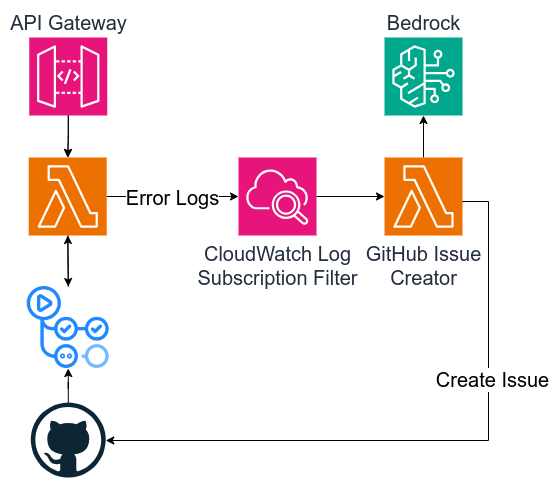

# AWS Error Insights with GenAI

Welcome to the Demo YVR DevOps GenAI Project!

This repository contains the source code for an Issue Creator Lambda function, designed to showcase the integration of AWS services, Terraform infrastructure as code, and the Anthropic API using AWS Bedrock with an innovative approach to automated GitHub issue creation.

## Overview

The main component of this project is:

1. **Example Lambda Function**: A Python-based AWS Lambda function that is triggered by API Gateway. It processes HTTP requests, parses JSON payloads, and demonstrates error handling and logging in a serverless environment.
2. **Issue Creator Lambda Function**: An AWS Lambda function that uses the Anthropic API via AWS Bedrock to generate GitHub issues based on error logs captured from the example Lambda function. This demonstrates an innovative approach to automated issue creation by using a large language model to interpret error logs.

## Architecture Diagram

<p align="center">
  
</p>

## Getting Started

To get started with this project, you'll need to have the following prerequisites:

- An AWS account
- Terraform installed
- A GitHub account, Personal Access Token (PAT), and a repository where you can create issues

### Setup Instructions

1. **Clone the Repository**: Clone this repository to your local machine.

   ```shell
   git clone https://github.com/autimo/demo-yvr-devops-genai.git
   ```

2. **Configure AWS Credentials**: Ensure your AWS credentials are configured properly. This can be done by setting up the AWS CLI and running `aws configure` or setting the `AWS_ACCESS_KEY_ID`, `AWS_SECRET_ACCESS_KEY`, and `AWS_REGION` environment variables.
3. **Terraform Initialization**: Navigate to the `terraform` directory and run `terraform init` to initialize the Terraform environment.
4. **Deploy Infrastructure**: Apply the Terraform configuration to deploy the necessary infrastructure to AWS.

   ```shell
   terraform apply
   ```

   Enter the required variables when prompted or create a `terraform.tfvars` file in the `terraform` directory with your specific values.

## GitHub Secrets and Variables

In order to successfully deploy and operate the components of this project, certain variables and secrets need to be configured in your GitHub repository's actions. Here's a breakdown of what's required:

### Secrets

- `GH_PAT`: A GitHub Personal Access Token with the necessary permissions to create issues in the specified repository.

### Variables

These are configured as environment variables in the `.github/workflows/push.yaml` file and are used across different steps in the GitHub Actions workflow:

- `TF_VERSION`: The version of Terraform to use.
- `PYTHON_VERSION`: The version of Python to use for running scripts.

Additionally, the following variables are used within the Terraform configuration and are prompted during the `terraform apply` command, but can also be predefined in a `terraform.tfvars` file:

- `AWS_IAM_ROLE_ARN`: The ARN of the AWS IAM role that GitHub Actions will assume for deploying resources.
- `AWS_REGION`: The AWS region where resources will be deployed.
- `AWS_S3_BUCKET_NAME`: The name of the S3 bucket used by Terraform for state storage.
- `AWS_DYNAMODB_TABLE_NAME`: The name of the DynamoDB table used by Terraform for state locking.

Ensure these secrets and variables are correctly set up in your GitHub repository and AWS account for the smooth operation of the project.

## Contributing

Contributions are welcome! If you have improvements or bug fixes, please feel free to fork the repository and submit a pull request.

## License

This project is licensed under the Apache License 2.0 - see the [LICENSE](LICENSE) file for details.

## TODO

- [ ] Read tag from lambda to decide if logs should be redacted from the issue
- [ ] Optionally get Github token SSM parameter from tag
- [ ] Instead of function name report the function arn in the issue. This provides more info
- [ ] Add timestamp of the event to the issue
- [ ] Add link to the cloudwatch log to the issue
- [ ] Store event metadata in dynamodb
- [ ] Add ECS support
- [ ] Custom prompt support for the issue creator
